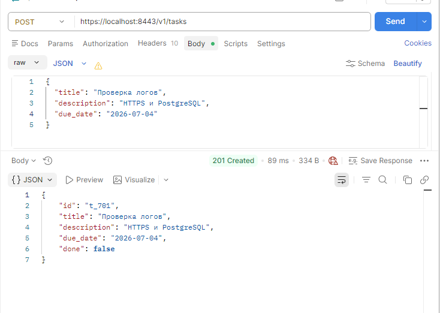
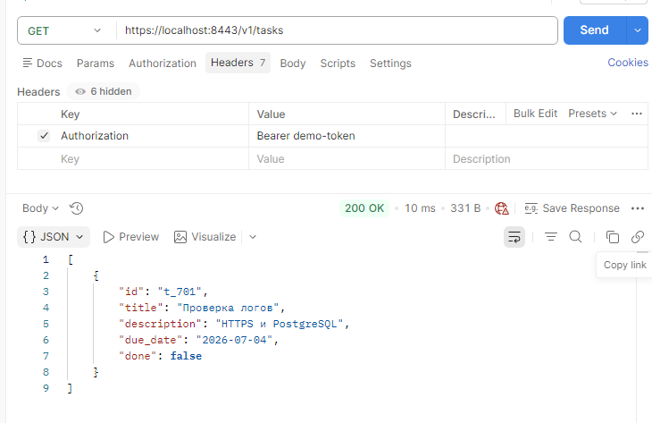
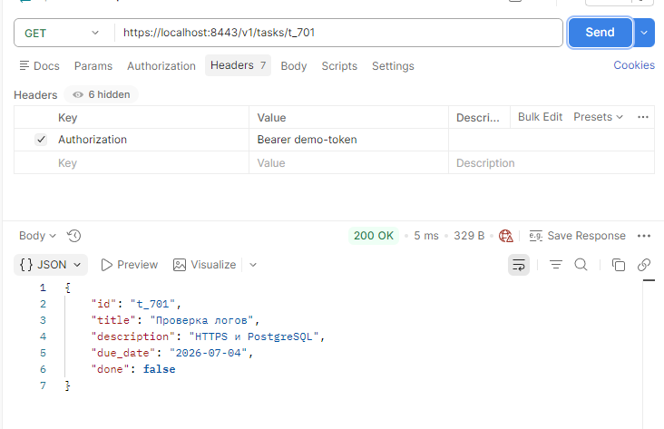
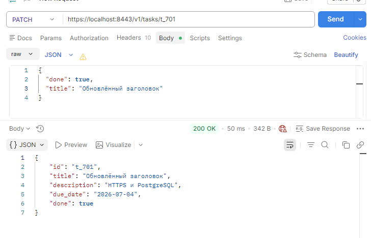
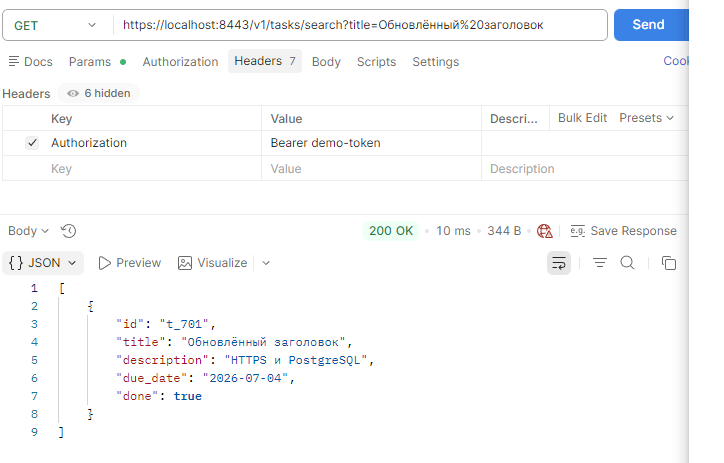

# Практика 4
## Выполнил: Студент ЭФМО-02-25 Фомичев Александр Сергеевич
### Структура:
```
deploy
    monitoring
        prometheus.yml
        docker-compose.yml
    tls
        docker-compose.yml
        nginx.conf
        init.sql
        cert.pem
        key.pem 
services 
    auth
        cmd
            auth
                main.go
        internal
            grpc
                server.go
            http
                handlers
                    login.go
                    verify.go
                routes.go
            service
                auth.go
    tasks
        Dpkerfile
        cmd
            tasks
                main.go
        internal
            metrics
                metrics.go
            grpcclient
                client.go
            http
                middleware
                    metrics.go
                handlers
                    tasks.go
                    middleware
                        auth.go
                routes.go
            service
                tasks.go
shared
    shared
        logger
            logger.go 
    middleware
        requestid.go
        accesslog.go
        grpclog.go
    httpx
        client.go
pkg
    api
        auth
            v1
                auth.proto
                auth.pb.go
                auth_grpc.pb.go
docs
    pz17_api.md
README.md
go.mod
go.sum
```
## Краткое описание, какой вариант TLS выбран.
Выбран вариант 1: TLS-терминация на NGINX.

Причины выбора:
  Ближе к промышленной практике (разделение ответственности).
  Управление сертификатами вынесено из кода приложения.
  NGINX выступает как reverse proxy, что позволяет легко добавлять балансировку, кэширование и дополнительные проверки.
  Приложение (сервис tasks) остаётся на HTTP, что упрощает его тестирование и отладку.

## Команды генерации сертификата.

cd deploy/tls
openssl req -x509 -newkey rsa:2048 -nodes -keyout key.pem -out cert.pem -days 365 -subj "//CN=localhost"

## Конфигурация NGINX.
events {}
```
http {
    server {
        listen 8443 ssl;
        server_name localhost;

        ssl_certificate /etc/nginx/tls/cert.pem;
        ssl_certificate_key /etc/nginx/tls/key.pem;

        location / {
            proxy_pass http://tasks:8082;
            proxy_set_header Host $host;
            proxy_set_header X-Forwarded-Proto https;
            proxy_set_header X-Request-ID $http_x_request_id;
            proxy_set_header Authorization $http_authorization;
        }
    }
}
```
## Описание БД.
Использована PostgreSQL (контейнерная). Таблица tasks создаётся автоматически при первом запуске с помощью init.sql.

id – уникальный идентификатор задачи (текстовый).
title – заголовок (обязательное).
description – описание.
due_date – срок выполнения (строка).
done – флаг выполнения.
created_at – время создания (автоматически).

## Демонстрация SQLi:
**как выглядел уязвимый запрос**

**как он исправлен параметризацией**

**пример проверки**.
**.png)**
****
****
****
****
****

## Инструкция запуска всего стенда.

**Требования**
  Установленные Docker Desktop (Windows) и Git Bash (или любой терминал).
  Go (локально) – для запуска Auth сервиса.
  Свободные порты: 8081 (Auth HTTP), 50051 (Auth gRPC), 8443 (NGINX), 5433 (PostgreSQL хост-порт, опционально).

**Шаги**
Клонировать репозиторий и перейти в корень проекта.
Сгенерировать TLS-сертификаты.
Запустить Auth сервис локально (так как он не контейнеризирован в этой части):
```
bash
cd services/auth
set AUTH_PORT=8081
set AUTH_GRPC_PORT=50051
go run ./cmd/auth
```
Запустить Docker Compose (в отдельном терминале):
```
bash
cd deploy/tls
docker-compose up -d
```
